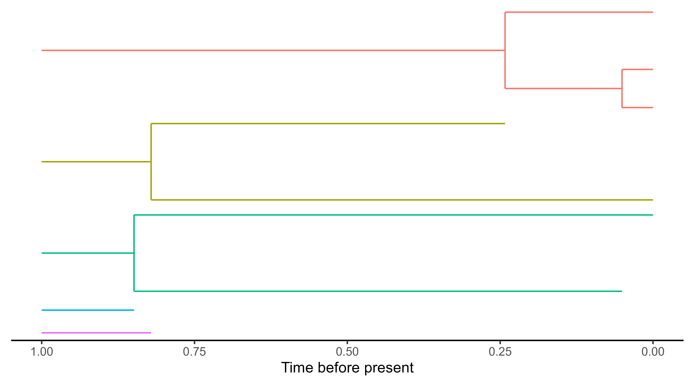

## Summary

Islands have long been study systems in evolutionary biology because of their isolated, replicated and often idiosynchratic species and ecosystems. The evolutionary history of island species can be reconstructed with genetic data producing a phylogenetic tree. `DAISIEmainland` is an R package that simulates the colonisation and diversification of species from a evolving mainland species pool to a focal island system. The package contains functionality to: (1) simulate phylogenetic data, (2) visualise data, (3) calculate and plot summary metrics of the simulated data. The data is outputted in the `DAISIE` format [@etienne_daisie_2022], for ease of application to the `DAISIE` R package which provides a suite of phylogenetic likelihood inference models for island biogeography.

## Statement of Need

Analysis of phylogenetic data has provided many insights in evolutionary biology. Central to these advances is the R language and the multitude of R packages which has facilitated the widespread utilisation these methods [@paradis_analysis_2006]. Phylogenetic research in the domain of island biogeography was lacking until the development of the Dynamic Assembly of Island biota through Speciation, Immigration and Extinction (DAISIE) model provided several key findings the macroevolution of island species [@valente_equilibrium_2015; @valente_simple_2020]. However, the performance and robustness of this island biogeography inference model is unknown when its assumptions are violated under biologically realistic scenarios. A central assumption of the DAISIE likelihood model is a static unevolving mainland pool of species. DAISIEmainland allows for the simulation of phylogenetic data of island species that can be used to test whether a dynamic mainland species pool causes poor model estimation performance. The package allows for testing multiple scenarios that may be faced by empiricists: mainland species go extinct before the present, mainland species are taxonomically known but not phylogenetically sampled, and mainland species are taxonomically undiscovered. The DAISIEmainland package has been applied to test the the robustness of the `DAISIE` model [@lambert_effect_2022] (see `vignette(topic = "inference_performance", package = "DAISIEmainland")` for details).

## Simulation Algorithm

The Doob-Gillespie algorithm is a stochastic exact solution that is used to simulate continuous-time processes [@gillespie_general_1976; @gillespie_exact_1977; gillespie_stochastic_2007], with several applications in biological modelling [@allen_efficient_2009]. The Doob-Gillespie algorithm can be used in evolutionary biology, for example to efficiently simulate a birth-death process. The island-mainland simulation in the DAISIEmainland package uses a two-part Doob-Gillespie simulation, one for the mainland and one for the island. Firstly the mainland, which is simulated under a Moran process [@moran_random_1958], whereby every species extinction is immediately followed by a random species giving rise to two new species (speciation).

Figure 1: Mainland 

The island Doob-Gillespie algorithm is altered to accommodate the dynamic mainland pool. The time-steps are bounded to not jump over changes on the mainland to ensure the present state of the system (i.e. species on mainland) is always up-to-date. The algorithm checks whether any changes have occurs on the mainland since the last time step and if so the system is updated and the returned to that point in time. This is valid owing to the Markov (memoryless) property of the Doob-Gillespie algorithm [@gillespie_general_1976; @gillespie_exact_1977; gillespie_stochastic_2007].

Figure 2: Island

For both the island and mainland Doob-Gillespie algorithms time steps are sampled from an exponential distribution with rate $(\sum_j r_j)$, where $r_j$ are the rates, for the mainland process this is just the rate of mainland extinction ($\mu_M$), this is the only mainland parameter, whereas, for the island algorithm $r_j$ are the rates of cladogenesis ($\lambda^c$), island extinction ($\mu$), colonisation ($\gamma$), and anagenesis ($\lambda^a$). After the time step ($\Delta$ t) is sampled the event is sampled from a dynamic discrete probability distribution, weighted by its rate (propensity) relative to all other rates (i.e. $r_i / \sum_j r_j$). The system is then updated for the algorithm repeats until the time step exceeds the total time of the simulation. Lastly, the data is formatted and the endemicity of each island colonist is assigned which is used in the `DAISIE` inference model. The `DAISIEmainland` simulation outputs two data sets: (1) contains full information of all species colonisation times, and (2) an incomplete information data set which resembles what an empirist would have access to. These two data sets allow for the quantification of error in estimation when the empirists does not have access to all the data (Fig. 2).

See `vignette(topic = "visualising_data", package = "DAISIEmainland")` for details.

## Acknowledgements

Thanks to Luis Valente and Shu Xie for helpful discussions. JWL was funded through a Study Abroad Studentship by the Leverhulme Trust and was also funded by a NWO VICI grant awarded to RSE. PSN was funded through a FCT PhD Studentship with reference SFRH/BD/129533/2017, co-funded by the Portuguese Ministério da Ciência, Tecnologia e Ensino Superior and the European Social Fund.

## References
