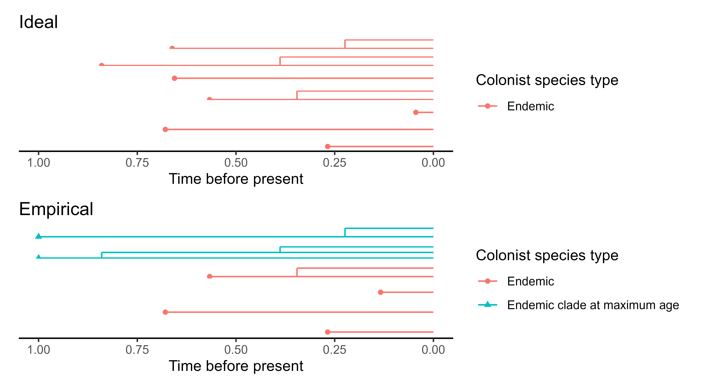

# `DAISIEmainland`: an R package for simulating macroevolution on islands with a dynamic mainland

## Authors: Joshua W. Lambert, Richèl J.C. Bilderbeek, Pedro Santos Neves, Rampal S. Etienne

## Summary

Islands have long been study systems in evolutionary biology because of their isolated, replicated and often idiosynchratic species and ecosystems. The evolutionary dynamics of island species can be reconstructed with molecular data from present day species. `DAISIEmainland` is an R package that simulates the colonisation and diversification species from a evolving mainland species pool to a focal island system. The package contains functionality to visualise simulated data, calculate and plot summary metrics of the simulated data. The data outputted in the `DAISIE` format (Etienne et al., 2022), for ease of application to the `DAISIE` R package which provides a suite of phylogenetic likelihood inference models for island biogeography.

Figure 1: Mainland 

Figure 2: Island

## Statement of Need

Several key findings about the dynamics island macroevolution have come from the application of Dynamic Assembly of Island biota Speciation, Immigration and Extinction (DAISIE) (Valente et al., 2015, 2020). The performance of this island biogeography inference model is unknown even in under biologically unrealistic assumption. DAISIEmainland allows for the simulation of phylogenetic island biogeography data that can be used to test whether a dynamic mainland species pool causes poor model estimation performance. The package allows for testing multiple scenarios that may be faced by empiricists: mainland species go extinct before the present, mainland species are taxonomically known but not phylogenetically sampled, and mainland species are taxonomically undiscovered. 

The first scientific application of the DAISIEmainland R package is to conduct a performance analysis of the DAISIE inference model (Lambert et al., 2022). The DAISIE inference model can test many hypotheses in island biogeography, but under the assumption that the mainland species do not evolve macroevolutionary time scales (several millions of years). The DAISIEmainland package can produce data simulated with dynamic mainland and thus by applying this data to the inference model and quantifying the error in parameter estimates the performance and robustness of the models can be determined. See Lambert et al. 2022 or `vignette(topic = "example", package = "DAISIEmainland")` for more detail.

## Simulation Algorithm

The Gillespie algorithm is a stochastic exact solution that is used simulate processes (Gillespie, 1976, 1977, 2007). It has several applications and extensions (see Allen and Dytham, tau leaping paper). The Gillespie algorithm can be used in evolutionary biology, for example to efficiently simulate a birth-death process (ref). The island-mainland simulation in the DAISIEmainland package uses a two-part Gillespie simulation. Firstly the mainland, which is simulated under a Moran process (Moran, 1958) uses a Gillespie algorithm where the time steps are given by the rate of mainland extinction which is the only parameter that effects events on the mainland. The Moran process means every species extinction is immediately followed by a random species giving rise to two new species (speciation). The second Gillespie algorithm is for simulating the island, and involves exploiting the memoryless aspect of the Gillespie algorithm. The algorithm checks whether an changes have occurs on the mainland since the last time step and if so the system is updated and the returned to that point in time.

The Gillespie algorithm that simulates the island was altered to accommodate the dynamic mainland pool. The time-steps sampled from an exponential distribution are bounded to not jump over changes on the mainland to ensure the present state of the system (i.e. species on mainland) is always up-to-date. This is valid owing to the Markov (memoryless) property of the Doob-Gillespie algorithm \citep{gillespie_exact_1977, gillespie_stochastic_2007}.

$$ P(\Delta t) = exp(\sum r_i) $$

where $r_i$ for the mainland process is just the rate of mainland extinction ($\mu_M$) and for the island process are the rates of cladogenesis ($\lambda^c$), island extinction ($\mu$), colonisation ($\gamma$), and anagenesis ($\lambda^a$). After the time step ($\Delta$ t) is sampled the event is sampled, weighted by its rate relative to all other rates (i.e. $r_i / r_{total}$). The system is then updated for the algorithm repeats until the time step exceeds the total time of the simulation.

Lastly, the data is formatted and the endemicity of each island colonist is assigned which is used in the `DAISIE` inference model.

## Acknowledgements

Thanks to Luis Valente and Shu Xie for helpful discussions. JWL was funded through a Study Abroad Studentship by the Leverhulme Trust and was also funded by a NWO VICI grant awarded to RSE. PSN was funded through a FCT PhD Studentship with reference SFRH/BD/129533/2017, co-funded by the Portuguese Ministério da Ciência, Tecnologia e Ensino Superior and the European Social Fund.

## References

Etienne R.S et al., 2022 DAISIE R package

Gillespie 1966

Gillespie 1967

Gillespie 2007

Lambert et al., 2022 The effects...

Valente et al., 2015 Ecol Lett

Valente et al., 2020 Nature